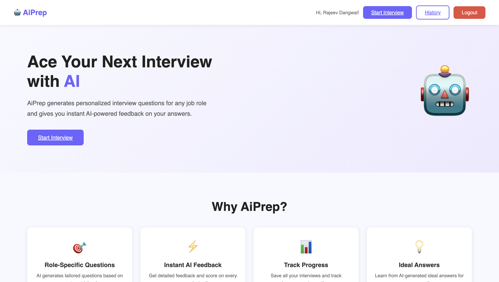
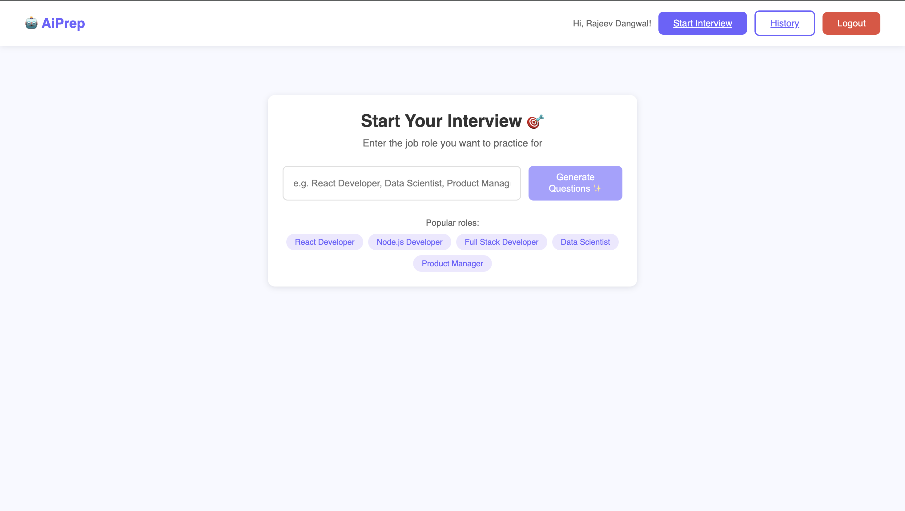
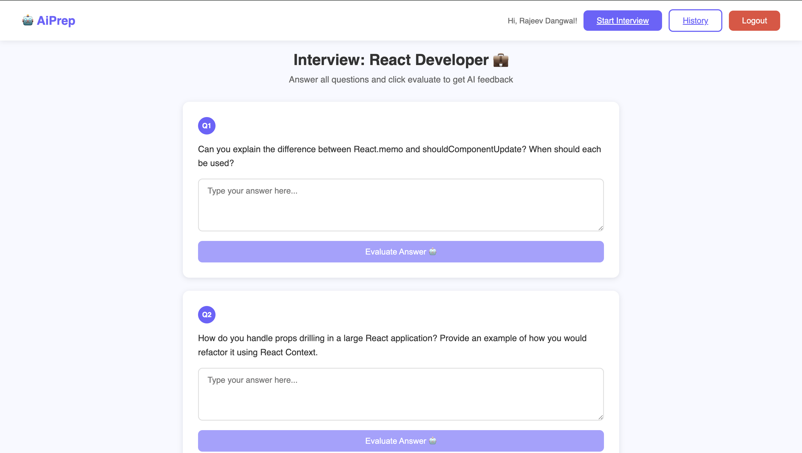

# AiPrep 🤖

> AI-powered interview preparation platform — generate role-specific questions & get instant feedback using LLaMA AI


---

## 📌 About

**AiPrep** is a full-stack web application that helps users prepare for technical interviews using AI. Enter any job role, get AI-generated interview questions, answer them, and receive instant scoring and feedback powered by Groq's LLaMA 3.1 model.

---

## ✨ Features

- 🎯 **Role-Specific Questions** — AI generates 5 tailored interview questions for any job role
- ⚡ **Instant AI Feedback** — Get detailed feedback and score (0-10) on every answer
- 💡 **Ideal Answers** — Learn from AI-generated ideal answers for every question
- 📊 **Performance Tracking** — View overall score and grade after each interview
- 📚 **Interview History** — Save and review all past interviews
- 🔐 **Secure Auth** — JWT-based authentication with register/login
- 📱 **Responsive UI** — Works on desktop and mobile

---

## 🛠️ Tech Stack

### Frontend
| Tech | Purpose |
|---|---|
| React 18 | UI framework |
| React Router v6 | Client-side routing |
| Axios | HTTP requests |
| Context API | State management |
| Vite | Build tool |

### Backend
| Tech | Purpose |
|---|---|
| Node.js | Runtime |
| Express.js | Web framework |
| MongoDB Atlas | Database |
| Mongoose | ODM |
| JWT | Authentication |
| Bcryptjs | Password hashing |

### AI
| Tech | Purpose |
|---|---|
| Groq SDK | AI API client |
| LLaMA 3.1 8B | Question generation & evaluation |

---

## 🚀 Getting Started

### Prerequisites
```
node >= 18
npm >= 9
MongoDB Atlas account
Groq API key (free at console.groq.com)
```

### 1. Clone the repository
```bash
git clone https://github.com/Rajeev5842/aiprep.git
cd aiprep
```

### 2. Setup Backend
```bash
cd server
npm install
```

Create `server/.env`:
```
PORT=8000
MONGO_URI=your_mongodb_connection_string
JWT_SECRET=your_super_secret_key
GROQ_API_KEY=your_groq_api_key
```

Start backend:
```bash
npm run dev
# Server runs on http://localhost:8000
```

### 3. Setup Frontend
```bash
cd client
npm install
npm run dev
# React runs on http://localhost:5173
```

---

## 📁 Project Structure

```
aiprep/
├── client/                     # React Frontend
│   └── src/
│       ├── components/
│       │   └── Navbar.jsx      # Navigation bar
│       ├── context/
│       │   └── AuthContext.jsx # Auth state management
│       ├── pages/
│       │   ├── Home.jsx        # Landing page
│       │   ├── Login.jsx       # Login page
│       │   ├── Register.jsx    # Register page
│       │   ├── Interview.jsx   # Interview flow
│       │   ├── Results.jsx     # Results page
│       │   └── History.jsx     # Interview history
│       ├── utils/
│       │   └── api.js          # Axios instance
│       └── App.jsx             # Routes
│
└── server/                     # Node.js Backend
    ├── middleware/
    │   └── auth.js             # JWT middleware
    ├── models/
    │   ├── User.js             # User schema
    │   └── Interview.js        # Interview schema
    ├── routes/
    │   ├── auth.js             # Register/Login routes
    │   ├── interview.js        # Interview CRUD routes
    │   └── ai.js               # Groq AI routes
    └── server.js               # Express app entry
```

---

## 🔌 API Endpoints

### Auth
```
POST /api/auth/register    Register new user
POST /api/auth/login       Login user
```

### AI
```
POST /api/ai/generate-questions    Generate interview questions
POST /api/ai/evaluate-answer       Evaluate user answer
```

### Interview
```
POST   /api/interview/save         Save completed interview
GET    /api/interview/history      Get user's interview history
GET    /api/interview/:id          Get single interview
DELETE /api/interview/:id          Delete interview
```

---

## 🎯 How It Works

```
1. User registers / logs in
        ↓
2. Enters job role (e.g. "React Developer")
        ↓
3. Groq LLaMA AI generates 5 questions
        ↓
4. User answers each question
        ↓
5. AI evaluates answer → score + feedback + ideal answer
        ↓
6. Results saved to MongoDB
        ↓
7. User can view history anytime
```

---

## 📸 Screenshots

<table>
  <tr>
    <td align="center">
      
      <br/>
      <b>Home Page</b>
    </td>
    <td align="center">
      
      <br/>
      <b>Interview Page</b>
    </td>
    <td align="center">
      
      <br/>
      <b>Questions Page</b>
    </td>
  </tr>
</table>

---

## 🌐 Live Demo

> Coming soon — deploying on Vercel + Render

---

## 🔑 Environment Variables

| Variable | Description |
|---|---|
| `PORT` | Server port (default: 8000) |
| `MONGO_URI` | MongoDB Atlas connection string |
| `JWT_SECRET` | Secret key for JWT tokens |
| `GROQ_API_KEY` | Groq API key for AI features |

---

## 📦 Available Scripts

### Backend
```bash
npm run dev    # Start with nodemon (development)
npm start      # Start without nodemon (production)
```

### Frontend
```bash
npm run dev      # Start Vite dev server
npm run build    # Build for production
npm run preview  # Preview production build
```

---

## 🤝 Contributing

1. Fork the project
2. Create your feature branch (`git checkout -b feature/AmazingFeature`)
3. Commit your changes (`git commit -m 'Add AmazingFeature'`)
4. Push to the branch (`git push origin feature/AmazingFeature`)
5. Open a Pull Request


---


## 👨‍💻 Author

**Rajeev Dangwal**
- GitHub: [@rajeevdangwal](https://github.com/Rajeev5842)

---
